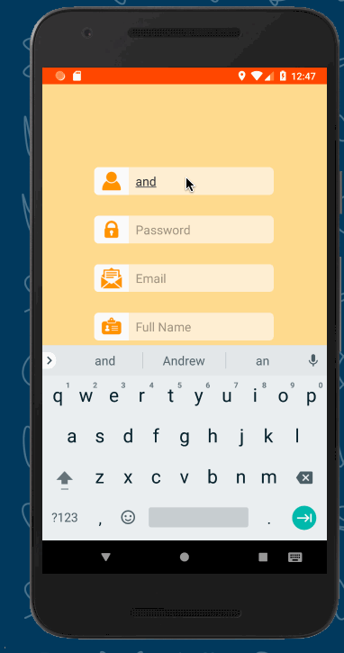
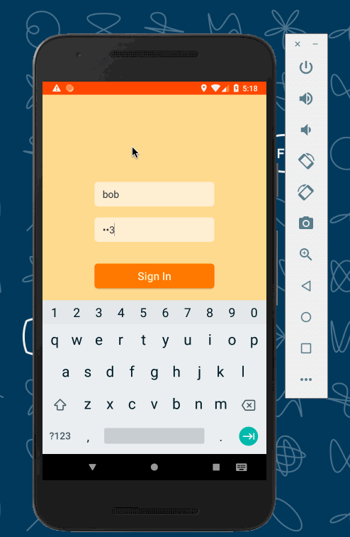

# MentorMe
MentorMe is an app that helps address the massive educational gap where students from underprivileged backgrounds do not get the resources they need and the education they deserve. We provide a free platform for these students to find and interact with mentors in their nearby communities.

# Short Description
Application that mentors and mentees based on shared interests, goals, available location, and other categories. Users can message, create events with, and review one another.

# Core User Stories
* matching algorithm (MVP/partial implementation)
* messaging capabilities
   * communicate through messenger of app so that you don't have to share personal info
* calendar
* goals, milestones (used by algorithm)
* Location
* Registration Flow —* (MVP/partial implementation)  — Be able to tell story

# Nice to have
* role model matching
    * Different roles: mentor/mentee/role model/buddy system "buddy"
* certification for mentors ***
    * linking to LinkedIn
* review system
    * Amazon, Yelp, etc
    * scale system
    * descriptive review
    * Scale per attribute
        * Upvote/downvote reviews of others
* (When2Meet) — time of day
* Group chats
    * example: mentor can send broad message to all mentees in some category
    * display as notifcations

# Stretch

* Section for free mentors, section for mentors with cost
    * limited payment (ie, pay for commute only)
* dual role ("pay" by teaching back)
* statistics
* credit system
    * "pay in" by mentoring people
    * "cash out" by being mentored
* Consider: payment systems? Non-payment
    mixed system (sometimes payments, sometime not)
* donation system
* Fund the costs for people that are less well off

# APIs
* Parse Push for push notification
* Google Calendar API

# Models
* User: areas of interest, skills, location, profile picture, current mentors/mentees
* Meeting: time, location
* Match and Chat: links between users
* Message
* ParseEvent
* Review: rating, description, photos

## Week 1 GIF

   

## Week 2 GIF

   

## Week 3-5 GIF

